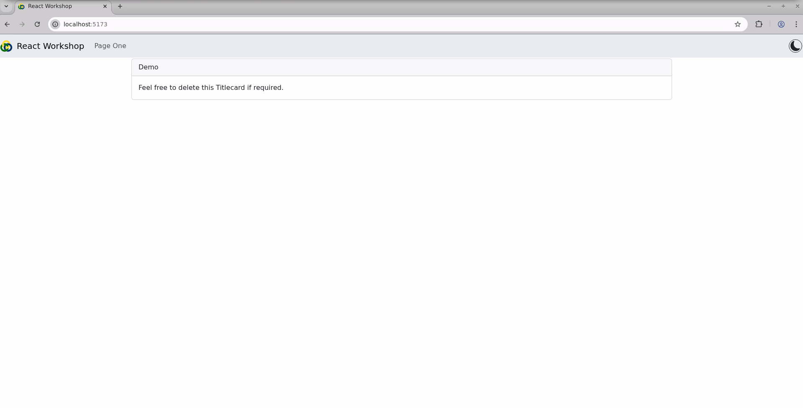
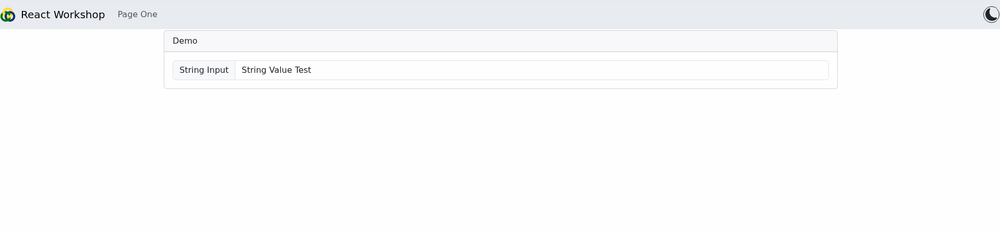
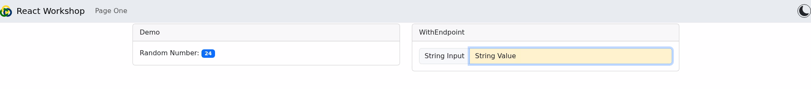
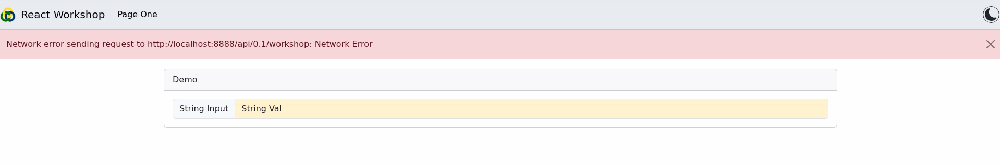

# Odin React Workshop

<p align="center">
    
</p>

# Introduction

## What is Odin React?

- A component library and GUI framework designed to work with [Odin Control](https://github.com/odin-detector/odin-control)
- Based on the [React](https://react.dev/) web development library, built with [Vite](https://vite.dev/)
- Designed to streamline, speed up, and unify GUI development for our detector projects
- Uses [Axios](https://axios-http.com/docs/intro) to handle HTTP requests. Axios is a promise based client that handles request and response serialization.

## What is React?

- A Javascript based library that allows for the creation of *Components*; individual reusable UI elements that can their own logic and state.
    - these components are Javascript Functions that return markup:
    ```javascript
    function MyButton() {
        // Notice Components always start with capital letters
        // to differentiate from standard HTML tags
        return(
            <button>I'm a button</button>
        );
    }
    ```
- This markup syntax is called **JSX**, which is what allows for the mixture of html and javascript within a single file and object.

## What Is Vite?

- Vite is an open source build tool that provides compilation and a development environment.
- During Development, vite provides a Development Server with Hot Module Replacement (where it monitors the code, and refreshes the server if any changes are made)
- Once development is complete, Vite bundles the source code, image assets, and dependencies together into a static web page that can be served by Odin Control

# Core Concepts

## Odin Control Adapter Connection
- Two component-like objects do all the heavy lifting of connecting to and using the Odin Control API, and cover everything a standard GUI would likely need in passing data to and from the Adapter:

### useAdapterEndpoint
- Provides all the RESTful API methods to interact with the Odin Control Adapter Parameter Tree
- Maintains a local copy of the Parameter tree
    - And the Metadata, if the adapter supports it.
- Can be setup to make periodic requests of the Adapter to monitor updating data
- Has error handling in case of HTTP errors, such as loss of connection or incorrectly done requests.

### WithEndpoint
- Wraps an existing Component to automate its connection to an Endpoint, creating a modified component that can then be reused.
- Provides event handlers that will perform http PUT requests as required.
- Supports buttons, text input, dropdowns, checkboxes, radio buttons, and more, automatically.
- Can be provided with functions to run before and/or after the PUT request
- Can monitor the value within the Endpoint Parameter Tree and display up to date data if changed.
- Can use metadata to limit input options (e.g: a number input with a Minimum and Maximum value)

## OdinApp
- A top level component that provides a navigation bar, routing to multiple pages, and a display for potential errors if something goes wrong.
- Should contain all the pages of a GUI, to properly render and navigate between them.

## Model-View-Controller Design Pattern
- Odin Control and Odin React are designed to separate *business logic* from the GUI presentation.
- The GUI should not implement control logic, but should trigger events within the Adapter to do so.

# Workshop

The workshop will involve making sure we have an Odin Control instance running to interact with, and then using [Cookiecutter](https://www.cookiecutter.io/) to instantiate a React Application using one of the available templates.

The workshop requires a python virtual environment of either `3.10` or `3.11`. Odin Control is currently incompatible with `3.12` but will soon be updated to allow this.

The workshop also requires `node.js`, which can be sourced from `/aeg_sw/apps` via `module load` if running this workshop from a machine connected to our network.

## Installing The Adapter

- An Odin Control Adapter is available for use within this workshop which will provide a parameter tree we can interact with using our GUI.

- To install it, navigate to the `control` directory within this repo and, using your preferred virtual environment (version 3.10 or higher), install the adapter:

```bash
cd control
pip install -e .
```

Run the adapter:
```bash
odin_control --config web/config/odin.cfg
```

## Creating the React Project

In a new terminal, create and move into the `static` directory, and copy one of the templated Odin React projects:

```bash
mkdir control/web/static
cd control/web/static

# Within a python Virtual Environment (this can be the same one as before), ensure `cookiecutter`is installed. This tool allows us to automatically download and build upon templates:

pip install cookiecutter

# Using cookie cutter, create a new project from one of the available templates:
cookiecutter git+ssh://git@github.com/stfc-aeg/odin-react-template
```

Cookiecutter will then provide prompts to select which template to use, and setup other values ready for the project. We're going to use the Typescript template, as using Typescript instead of Javascript gives us more control during development. It still compiles into standard Javascript when it runs or is built into the final application:

```bash
# Options from cookiecutter. Ideally, you should follow these options for the workshop:
Select a template
    1 - Javascript Template (javascript)
    2 - Typescript Template (typescript)
    Choose from [1/2] (1): 2
  [1/6] Set the name of the project (Project Name): React Workshop
  [2/6] Set the name of the package (reactworkshop): 
  [3/6] Name of the adapter that the default template will connect to (reactworkshopAdapter): workshop
  [4/6] Name the main folder the application will be in (app): 
  [5/6] The default endpoint of the Odin Control instance (http://localhost:8888): http://localhost:8888
  [6/6] Include the optional Plotly package for graphing [y/n] (n): yes
```

Once created, you need to ensure the dependencies are installed and ready, and then you can start developing the app:

```bash
cd app
    # nodejs is the javascript runtime environment that allows us to use React. Source it from the DSSG module files on the network.
module load nodejs
    # this step will install all the dependencies declared in package.json. It may take a few minutes
npm install

    # after installation of the dependencies is completed, run the development server:
npm run dev
```

When running, the development server will display the address of the webpage it is serving. It will also monitor the React project's codebase, and will reload the server if anything changes.

Terminal Output:
```
  VITE v7.0.4  ready in 442 ms

  ➜  Local:   http://localhost:5173/
  ➜  Network: use --host to expose
  ➜  press h + enter to show help
```

Open this address in your web browser and you should see something like the following:
<p align="center">

</p>

## Begin developing the React Project

Now that you have a starting point, we can begin to build upon this to add interactivity with the Adapter!

### Modify the AdapterEndpoint

Because we are developing in Typescript, we can tell the [AdapterEndpoint](https://github.com/stfc-aeg/odin-react/wiki/useAdapterEndpoint) what the Parameter Tree will return using an [Interface](https://www.typescriptlang.org/docs/handbook/2/objects.html). This will make accessing the values within easier in future development, as the development environment will already know what is available and what the types are, which can help catch typos and other errors.

Lets first look at what the Parameter Tree looks like in the adapter:

```python
# controller.py
def __init__(self, options):
    
    # ...

    self.param_tree = ParameterTree({
            "string_val": (lambda: self.string_val, self.set_string),
            "num_val": (lambda: self.num_val, self.set_num_val,
                        {  # metadata
                            "min": 15,
                            "max": 76
                        }),
            "num_details": {
                "is_even": (lambda: not (self.num_val % 2), None),
                "half": (lambda: self.num_val / 2, None)
            },
            "rand_num": (lambda: self.random_num, None),
            "select_list": (lambda: self.selection_list, None),
            "selected": (lambda: self.selected, self.set_selection),
            "toggle": (lambda: self.toggle, self.set_toggle),
            "trigger": (None, self.trigger_event)
        })
```

Based on that, we can define an Interface to tell the `AdapterEndpoint` what to expect from the Parameter Tree, by defining the type of each Parameter:

``` TSX
//app.tsx
import { OdinApp, useAdapterEndpoint } from 'odin-react';
import { TemplatePage } from './TemplatePage';

import type { ParamTree } from 'odin-react';

const interface ParamTreeTypes extends ParamTree {
    string_val: string;
    num_val: number;
    num_details: {
        is_even: boolean;
        half: number;
    }
    rand_num: number;
    selected_list: string[];
    selected: string;
    toggle: boolean;
    trigger: null;
}

function App() {
    
    const endpoint = useAdapterEndpoint<ParamTreeTypes>("workshop", import.meta.env.VITE_ENDPOINT_URL);

    return (
        // ...
```

We've provided the `endpoint` with the defined Parameter Tree structure using a [Type Variable](https://www.typescriptlang.org/docs/handbook/2/generics.html). This tells the `endpoint` the Type that it's returned `data` will be, which means we can better access those values and know what to expect.

Now that the `endpoint` has been setup, we can modify the `TemplatePage` component to accept the `endpoint` as a [Property](https://react.dev/learn/passing-props-to-a-component), and then add some components that will use the `endpoint`.

### Passing the Endpoint as a Prop.

First, we need to tell the `TemplatePage` component to accept an Endpoint as a Prop, so that any Child component of the page can also receive the endpoint, if required.

> [!NOTE]
> In React, Props always flow from Parent to Child, not vice versa. This is why the default `endpoint` in the template gets created in the higher level `App` component and passed down; so that it can be used by multiple pages if required. This default can be moved within a specific page if only that page will require it.

``` TSX
// TemplatePage.tsx
import { TitleCard } from "odin-react"

import Container from "react-bootstrap/Container";
import Row from 'react-bootstrap/Row';
import Col from 'react-bootstrap/Col';

import type { AdapterEndpoint_t } from 'odin-react';

// its common practice to define the props for a component in an interface
interface TemplateProps {
    endpoint: AdapterEndpoint_t;
}

//pass the interface as a Type Variable to the return type of TemplatePage (React.FC)
export const TemplatePage: React.FC<TemplateProps> = (props) => {

    //deconstruct the props to get the values from them. In this case, just the endpoint
    const {endpoint} = props;
    
    return (
        <Container>
        <Row>
        <Col>
            <TitleCard title="Demo">
                Feel free to delete this Titlecard if required.
            </TitleCard>
        </Col>
        </Row>
        </Container>
    )
}
```

Then, we can pass the endpoint to the component from the parent component:

``` TSX
//App.tsx

...

const endpoint = useAdapterEndpoint("workshop", import.meta.env.VITE_ENDPOINT_URL);

return (
    <OdinApp title='React Workshop' navLinks={["Page One"]}>
      <TemplatePage endpoint={endpoint}/>
    </OdinApp>
  )

```

### Creating A Component that uses the Endpoint

We now need to create a component that can use the `Endpoint` that can read and write one of the Parameters. We can do this with the [WithEndpoint](https://github.com/stfc-aeg/odin-react/wiki/WithEndpoint) Higher Order Component, which will return a component that has the required props and event handlers to make use of the `Endpoint`.

Lets start with a [textbox](https://react-bootstrap.netlify.app/docs/forms/form-control):
``` TSX
// TemplatePage.tsx

import { TitleCard } from "odin-react"
//import the WithEndpoint wrapper from odin-react
import { WithEndpoint } from 'odin-react';


import Container from "react-bootstrap/Container";
import Row from 'react-bootstrap/Row';
import Col from 'react-bootstrap/Col';

//import the Form component from bootstrap
import Form from 'react-bootstrap/Form';

import type { AdapterEndpoint_t } from 'odin-react';

//declare a new component based on the Form.Control, using WithEndpoint
//notice that we do not provide it with the endpoint or anything at this stage. We've basically just made a new component we can then use.
const EndpointInput = WithEndpoint(Form.Control);

...

```

> [!NOTE]
> Components created using `WithEndpoint` automatically make some assumptions about what you want them to do depending on the type of component and data it points to in the `AdapterEndpoint`. A `WithEndpoint` wrapped Button will, for instance, assume you want it to trigger when clicked, with whatever value you provide.
> 
> If you do not provide a value, a `WithEndpoint` component will use the value read from the Parameter Tree, at whatever path you point it at.

Now we've created this `EndpointInput` component, we can use it to interact with the Odin Control Adapter, via the `AdapterEndpoint`. This automates a lot of the data handling for the HTTP requests.

We can also still treat it like the original `Form.Control` that it wraps, and so can label it using some of the other [Bootstrap Form Components](https://react-bootstrap.netlify.app/docs/forms/overview):

``` TSX
// TemplatePage.tsx

import Form from 'react-bootstrap/Form';
import InputGroup from 'react-bootstrap/InputGroup';

...

    return (
        <Container>
        <Row>
        <Col>
            <TitleCard title="Demo">
                {/*endpoint and fullpath are the only two REQUIRED props for a WithEndpoint component*/}
                <InputGroup>
                    <InputGroup.Text>String Input</InputGroup.Text>
                    <EndpointInput endpoint={endpoint} fullpath="string_val"/>
                </InputGroup>
            </TitleCard>
        </Col>
        </Row>
        </Container>
    )
}
```

This textbox will automatically display the current value from the `AdapterEndpoint` Parameter Tree, and will do a PUT request to the path specified if you change the value and hit the Enter key. If we return to the browser, the changes made to the page should have been reloaded and the Input but now visible:

<p align="center">

</p>

And when changing the value, the input is highlighted to show that it has been modified:

<p align="center">

</p>

If you then hit the Enter key whilst editing the text within the box, it will be sent to the Adapter. You should see something similar to the following in the terminal running Odin Control:

```bash
[D 250714 15:45:38 server:138] 204 OPTIONS /api/0.1/workshop (127.0.0.1) 1.05ms
[D 250714 15:45:38 controller:92] PUT request received at path:  with data {'string_val': 'String Value'}
[D 250714 15:45:38 controller:84] GET request received at path: 
[D 250714 15:45:38 server:138] 200 PUT /api/0.1/workshop (127.0.0.1) 1.74ms
```

The `EndpointInput` component can also be used for other Parameters in the same way, including numerical ones.

>[!NOTE]
> `WithEndpoint` wrapped components will utilize the metadata provided by the Parameter Tree. If a Parameter is not defined as *Writeable*, the component will be disabled so that the user can visually see it is not an editable field.
>
> With numerical Parameters it will also use any *min* or *max* values defined in the metadata.

`WithEndpoint` can also be used to create other endpoint connected components, like [buttons](https://react-bootstrap.netlify.app/docs/components/buttons) and [dropdowns](https://react-bootstrap.netlify.app/docs/components/dropdowns). It works the same way the `EndpointInput` did, automatically detecting what should trigger a PUT request.

## Error Handling

- The Templated project sets up some error handling mechanisms for the application.
    - This will automatically display on screen any errors that may occur due to the Odin Control Adapter being inaccessible, or other issues with the HTTP requests.
- Test this by shutting down the Odin Control instance and attempting to enter a new value for a parameter:

<p align="center">

</p>

## Layout

- Odin React is designed to make use of the [Bootstrap Grid Layout](https://react-bootstrap.netlify.app/docs/layout/grid)
- Organise page contents using the `Row` and `Col` components
    - Bootstrap provides means to set the width of the columns as shown [Here](https://react-bootstrap.netlify.app/docs/layout/grid#setting-one-column-width). The grid classes shown split the width of the container into **12**, so setting a grid class to **6** would set it to take up half the space available.
- Group related controls and components within a [Title Card](https://github.com/stfc-aeg/odin-react/wiki/TitleCard)

## React Hooks

[Hooks](https://react.dev/reference/react/hooks) are a React feature that allow you to add different features to React Components. React provides a handful of build-in Hooks that are useful to know about.

Hooks can only be used at the **Top Level of a Component**. They cannot be

### [useState](https://react.dev/reference/react/useState)

- Components sometimes need to "remember" information, such as user input. This kind of component-specific memory is called [State](https://react.dev/learn/state-a-components-memory).

- We can't use standard variables for this, as they won't persist between renders. When React re-renders a component due to any changes, it won't consider changes made to local variables.

- `useState` is a Hook that lets you add this state to your component in a way that will persist, even if the component gets re-rendered. This state will also trigger React to render the component with the new data.

```tsx
import { useState } from 'react';

...

const [state, setState] = useState(initialState);
```

- The hook provides two things, a **State Value** (`state`), and a **State Setter Function** (`setState`) to update that state.
- Calling the **Setter Function** with a new value will update the **State Value** when the component is re-rendered.
- The **Setter Function** can set state based on previous state by passing an **Updater Function**:
  ``` tsx
  setState(oldState => oldState + 1);
  ```

> [!WARNING]
> The **Setter Function** does not update the **State Value** in currently running code. It instead requests a re-render of the component will the new state. That means that you cannot update a state within a function and then use the updated **State Value** straight away within that same function:
> ``` tsx
> const [count, setCount] = useState(0);
>
> function handleClick() {
>    console.log(count) // 0
>
>    setCount(count + 1); // Request rerender with 1
>    console.log(count); // still 0!
> }
> ```

### [useCallback](https://react.dev/reference/react/useCallback)

- Caches a function definition between re-renders, and only re-defines that function if any of it's **Dependencies** change

``` tsx
const cachedFunc = useCallback(Func, dependencies);
```

- Dependencies is a list of *Reactive Values* (Such as State or Props) within the function that might change. If any of these values change, the callback updates the method to use the new values.
- [Linters](https://eslint.org/) configured for React will verify that every *Reactive Value* within a function is specified as a dependency. It is unusual for a callback to not require every *Reactive Value* as a dependency, as missing dependencies means a callback runs the risk of running with stale State, or old values.

### [useEffect](https://react.dev/reference/react/useEffect)

- Runs an Effect whenever one of its **Dependencies** changes.
- Will run when the component first loads
- The Effect can return a *Cleanup* function that will run first when the dependencies change with the old values, before running the effect
- Often used with [setInterval](https://developer.mozilla.org/en-US/docs/Web/API/Window/setInterval) to call a function repeatedly

``` tsx

const interval = 1000;

useEffect(() => {
    const timer_id = setInterval(PeriodicFunc, interval);  // run PeriodicFunc every second

    return () => {
        clearInterval(timer_id); //cleanup code
    }
}, [interval, PeriodicFunc]); //array of Dependencies
```

> [!TIP]
> If you want an Effect to run only when the component initially renders, pass it an **Empty Dependency Array**. If you don't pass it any dependency array, the effect will run **after every re-render of the component**.

> [!WARNING]
> **Using Objects in Dependency Arrays is a Bad Idea**
>
> Because of the way React compares Objects, putting an object into a Hook's *Dependency Array* will cause that hook to re-run at every render.
>
> The [React Docs](https://react.dev/learn/removing-effect-dependencies#does-some-reactive-value-change-unintentionally) have more details about why this happens, and how to negate the issue.
