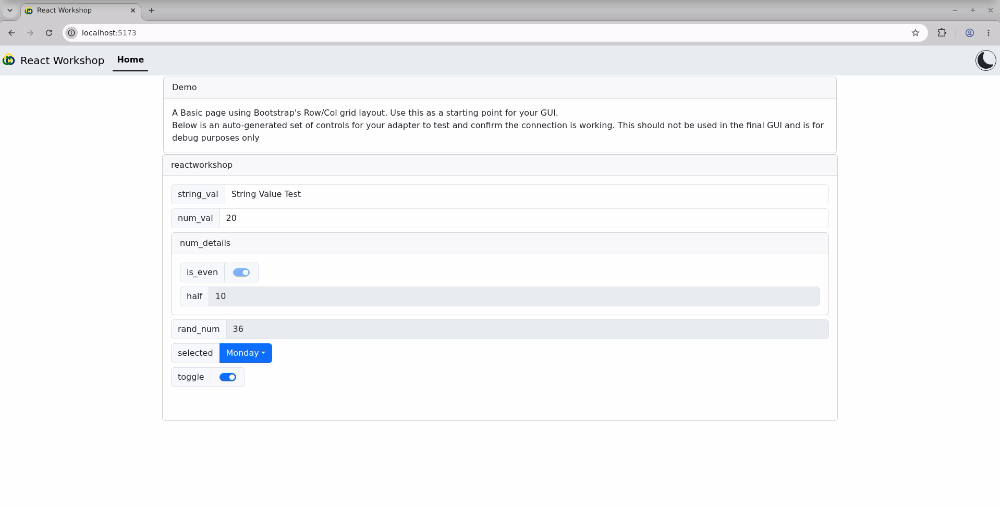
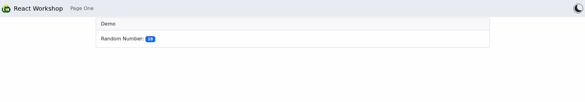
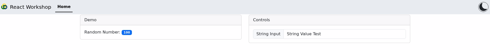
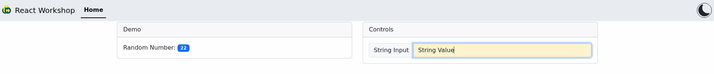
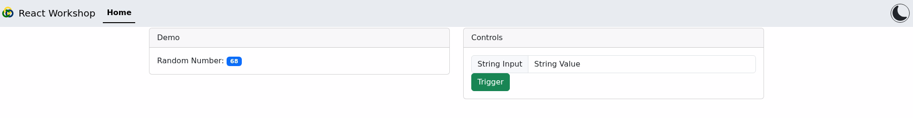
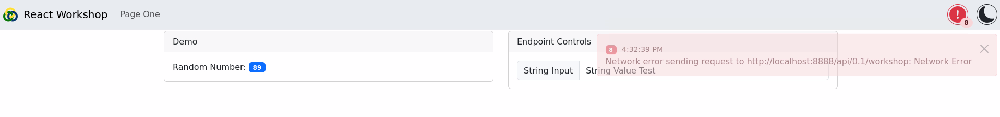

# Odin React Workshop

<p align="center">
    
</p>

# Introduction

## What is Odin React?

- A component library and GUI framework designed to work with [Odin Control](https://github.com/odin-detector/odin-control)
- Based on the [React](https://react.dev/) web development library, built with [Vite](https://vite.dev/)
- Designed to streamline, speed up, and unify GUI development for our detector projects
- Uses [Axios](https://axios-http.com/docs/intro) to handle HTTP requests. Axios is a promise based client that handles request and response serialization.

Odin React uses [Storybook](https://storybook.js.org/) to document, demo, and test. For more details, see the links below:
- [Interactive Documentation](https://stfc-aeg.github.io/odin-react/)
- [Live Demo](https://stfc-aeg.github.io/odin-react/iframe.html?id=demo-page--default&viewMode=story)

## What is React?

- A Javascript based library that allows for the creation of *Components*; individual reusable UI elements that can their own logic and state.
    - these components are Javascript Functions that return markup:

```javascript
function MyButton() {
    // Notice Components always start with capital letters
    // to differentiate from standard HTML tags
    return(
        <button>I'm a button</button>
    );
}
```

- This markup syntax is called **JSX**, which is what allows for the mixture of html and javascript within a single file and object.
- Components can be provided with arguments, called *props*, for various purposes. These are passed to the component like *html attributes*, and become an object parameter in the component function that can be [destructured](https://developer.mozilla.org/en-US/docs/Web/JavaScript/Reference/Operators/Destructuring).

```javascript
 function MyButton(props) {
    const button_text = props;

    return (
        <button>{button_text}</button>
    )
 }

 ...

 <MyButton button_text="Click Here" />
```

## What Is Vite?

- Vite is an open source build tool that provides compilation and a development environment.
- During Development, vite provides a Development Server with Hot Module Replacement (where it monitors the code, and refreshes the server if any changes are made)
- Once development is complete, Vite bundles the source code, image assets, and dependencies together into a static web page that can be served by Odin Control

# Core Concepts

## Odin Control Adapter Connection
- Two component-like objects do all the heavy lifting of connecting to and using the Odin Control API, and cover everything a standard GUI would likely need in passing data to and from the Adapter:

### useAdapterEndpoint
- Provides all the RESTful API methods to interact with the Odin Control Adapter Parameter Tree
- Caches a copy of the Parameter tree
    - And the Metadata, if the adapter supports it.
- Can be setup to make repeated requests of the Adapter to monitor updating data
- Has error handling in case of HTTP errors, such as loss of connection or incorrectly done requests.

### Endpoint Components
- Pre-existing Input components (such as buttons or text boxes) with added functionality to automatically work with an Adapter Endpoint, performing PUT requests whenever appropriate.
    - For example, the `EndpointButton` component will do the PUT request whenever clicked.
    - An `EndpointInput` will PUT whenever the Enter key is hit while typing in the textbox.

### OdinApp
- A top level component that provides a navigation bar, routing to multiple pages, and a display for potential errors if something goes wrong.
- Should contain all the pages of a GUI, to properly render and navigate between them.

### Model-View-Controller Design Pattern
- Odin Control and Odin React are designed to separate *business logic* from the GUI presentation.
- The GUI should not implement control logic, but should trigger events within the Adapter to do so.

<br></br>

---
# Workshop

The workshop will involve making sure we have an Odin Control instance running to interact with, and then using a **Template Project** to start developing the GUI.

The workshop requires a python virtual environment compatiable with Odin Control. This is currently `3.8` or above.

The workshop also requires [nodejs](https://nodejs.org/en), which can be sourced from `/aeg_sw/apps` via `module load` if running this workshop from a machine connected to the DSSG network.

## Installing The Adapter

- An Odin Control Adapter is available for use with this workshop which will provide a parameter tree we can interact with using our GUI.

- To install it, navigate to the `control` directory within this repo and, using your preferred python environment, install the adapter:

```bash
cd control
pip install .
```

Run the adapter:
```bash
odin_control --config web/config/odin.cfg
```

## Creating the React Project

With a basic Odin Control instance running, we can begin creating the GUI for that project.

> [!NOTE]
> To begin with, we'll copy a templated version of a basic Odin React GUI and run it in Development mode.
> 
> Once the GUI is completed, it can be compiled into static code and served by Odin Control as a static resource. While developing, the GUI will be served standalone on a different address and port than Odin Control, which means it must be configured to accept CORS (Cross Origin Sharing) requests.

Using `npm` (the `nodejs` package manager), we can use the available Template Project from the web. In a new terminal:
```bash
# The new terminal should be in the same directory as the Odin Control project
cd control

# This command fetches the templated Odin React project from npmjs.com, the package management site. It's similar to Python's PyPI.org.
npm create @dssg/odin-react

```

This should then provide us with a series of prompts on the command line to customise the template. Make sure your responses match those shown here:
```bash
┌  Create Odin React GUI
│
◇  GUI App Project Name
│  React Workshop
│
◇  GUI App Root Directory
│  web/static
│
◇  Name of the Adapter to connect to
│  reactworkshop
│
◇  URL of the Odin Control API
│  http://localhost:8889
│
◇  Include Plotly graphing Package?
│  No
│
◇  Install and run Dev Server?
│  Yes
```

You'll then see the output below, showing that it is copying and installing the template. Do note that the Dependency Installation step may take a few minutes.

```
│
◇  Initialising...
│
◇  Scaffolding Completed
│
◇  Updating package.json...
│
◇  Setting Adapter API config...
│
◇  Installing Dependencies with NPM...
```

When running, the development server will display the address of the webpage it is serving. It will also monitor the React project's codebase, and will reload the server if anything changes.

Terminal Output:
```
  VITE v7.0.4  ready in 442 ms

  ➜  Local:   http://localhost:5173/
  ➜  Network: use --host to expose
  ➜  press h + enter to show help
```

>[!IMPORTANT]
> If you do not see this output, you may have told the template not to automatically install and run, or you may have accidentally shut the server down. In which case, you'll need to run the following commands:
>
> ```bash
> cd web/static
> 
> # this step will install all the dependencies declared in "package.json" if they are not already. It may take a few minutes
> npm install
> 
> # after installation of the dependencies is completed, run the development server:
> npm run dev
> ```

Open this address in your web browser of choice (Odin React has been developed to explicitly support either **Firefox** or **Chrome**) and you should see something like the following:
<p align="center">

</p>

Feel free to use the generated controls to get a feel for how the various GUI components interact with your Odin Control adapter.

>[!IMPORTANT] This inital state of the React GUI grabs the full Parameter Tree from your Odin Control server and displays some auto-generated controls based on the response.
>
> If for some reason you do not see these controls, and/or see warnings about the connection, check that your Odin Control server is running and that the address used when copying the React Template matches the one Odin Control is listening on.

## Begin developing the React Project

Now that you have a starting point, we can begin to build upon this to add specific controls with the Adapter!

### Remove the Auto Generated Controls

Whilst useful for testing a new GUI project, the generated controls are not designed for use in a final system. Our first step should be to remove these controls to replace them with our own specific design.

With your preferred code editor, open `control/web/static/src/Page.tsx` and make the following changes:

```diff
- import { TitleCard, ParamController } from "@dssg/odin-react";
+ import { TitleCard } from "@dssg/odin-react";
import type { AdapterEndpoint } from "@dssg/odin-react";
import { Container, Row, Col } from 'react-bootstrap';
import { type EndpointParams } from "./App";

interface PageProps {
    endpoint: AdapterEndpoint<EndpointParams>
}

const Page = ({
    endpoint
}: PageProps) => {

    return (
        <Container>
            <Row>
                <Col>
                    <TitleCard title="Demo">
                        A Basic page using Bootstrap's Row/Col grid layout.
                        Use this as a starting point for your GUI.
                        <br />
                        Below is an auto-generated set of controls for your
                        adapter to test and confirm the connection is working.
                        This should not be used in the final GUI and is for debug
                        purposes only
                    </TitleCard>
                </Col>
            </Row>
            <Row>
                <Col>
-                   <ParamController endpoint={endpoint} title="reactworkshop"/>
                </Col>
            </Row>
        </Container>
    )
}

export default Page;
```

With that removed, we can add our own specific controls.


### Modify the AdapterEndpoint

Because we are developing in Typescript, we can tell the [AdapterEndpoint](https://github.com/stfc-aeg/odin-react/wiki/useAdapterEndpoint) what the Parameter Tree will return using an [Interface](https://www.typescriptlang.org/docs/handbook/2/objects.html). This will make accessing the values within easier in future development, as the development environment will already know what is available and what the types are, which can help catch typos and other errors.

Lets first look at what the Parameter Tree structure looks like in the adapter:

```python
# controller.py
def __init__(self, options):
    
    # ...

    self.param_tree = ParameterTree({
            "string_val": (lambda: self.string_val, self.set_string),
            "num_val": (lambda: self.num_val, self.set_num_val,
                        {  # metadata
                            "min": 15,
                            "max": 76
                        }),
            "num_details": {
                "is_even": (lambda: not (self.num_val % 2), None),
                "half": (lambda: self.num_val / 2, None)
            },
            "rand_num": (lambda: self.random_num, None),
            "select_list": (lambda: self.selection_list, None),
            "selected": (lambda: self.selected, self.set_selection),
            "toggle": (lambda: self.toggle, self.set_toggle),
            "trigger": (None, self.trigger_event)
        })
```

Based on that, we can define an Interface to tell the `AdapterEndpoint` what to expect from the Parameter Tree, by defining the return type of each Parameter:

``` TSX
//app.tsx
import { OdinApp, useAdapterEndpoint } from 'odin-react';
import { TemplatePage } from './TemplatePage';

import type { ParamTree } from 'odin-react';

//the EXPORT keyword means we can import this interface in other files, like TemplatePage.tsx
export interface ParamTreeTypes extends ParamTree {
    string_val: string;
    num_val: number;
    num_details: {
        is_even: boolean;
        half: number;
    }
    rand_num: number;
    selected_list: string[];
    selected: string;
    toggle: boolean;
    trigger: null;
}

function App() {

    const endpoint = useAdapterEndpoint<ParamTreeTypes>("workshop", import.meta.env.VITE_ENDPOINT_URL);

    return (
        // ...
```

We've provided the `endpoint` with the defined Parameter Tree structure using a [Type Variable](https://www.typescriptlang.org/docs/handbook/2/generics.html) (the part within the angled brackets). This tells the `endpoint` the Type that its returned `data` will be, which means we can better access those values and know what to expect.

>[!TIP]
> Because Typescript compiles to standard Javascript, providing this Interface does not restrict or limit what the AdapterEndpoint can actually receive from the Adapter. It's used for hinting during development and reduces the need for explicit type checks.

Now that the `endpoint` has been setup, we can modify the `TemplatePage` component to accept the `endpoint` as a [Property](https://react.dev/learn/passing-props-to-a-component), and then add some components that will use the `endpoint`.

### Passing the Endpoint as a Prop.

First, we need to tell the `TemplatePage` component to accept an Endpoint as a Prop, so that any Child component of the page can also receive the endpoint, if required.

> [!NOTE]
> In React, Props always flow from Parent to Child, not vice versa. This is why the default `endpoint` in the template gets created in the higher level `App` component and passed down; so that it can be used by multiple pages if required. This default can be moved within a specific page if only that page will require it.

``` TSX
// TemplatePage.tsx
import { TitleCard } from "odin-react"

import Container from "react-bootstrap/Container";
import Row from 'react-bootstrap/Row';
import Col from 'react-bootstrap/Col';

// import the types we need to define the Prop, including the Interface we defined.
import type { AdapterEndpoint_t } from 'odin-react';
import type { ParamTreeTypes } from "./App";

// its common practice to define the props for a component in an interface
interface TemplateProps {
    //define a prop called "endpoint" that is an Endpoint,
    // which returns data that matches the shape of ParamTreeTypes
    endpoint: AdapterEndpoint_t<ParamTreeTypes>;
}

//pass the interface as a Type Variable to the return type of TemplatePage (React.FC)
export const TemplatePage: React.FC<TemplateProps> = (props) => {

    //deconstruct the props to get the values from them. In this case, just the endpoint
    const {endpoint} = props;
    
    return (
        <Container>
        <Row>
        <Col>
            <TitleCard title="Demo">
                Feel free to delete this Titlecard if required.
            </TitleCard>
        </Col>
        </Row>
        </Container>
    )
}
```

Then, we can pass the endpoint to the `TemplatePage` component from the `App` parent component:

``` TSX
//App.tsx

...

const endpoint = useAdapterEndpoint("workshop", import.meta.env.VITE_ENDPOINT_URL);

return (
    <OdinApp title='React Workshop' navLinks={["Page One"]}>
      <TemplatePage endpoint={endpoint}/>
    </OdinApp>
  )

```

### Using the Endpoint Data

- The endpoint provides a `data` object we can reference to display our parameters.
- Since we previously used the `interface` to tell the endpoint whats available on the Parameter Tree, accessing those defined parameters is simple

We can add a label to the GUI that displays the current value of the `rand_num` parameter. This number gets updated periodically, so we can watch it for changes.

``` TSX
//TemplatePage.tsx

// Other Imports
...

import Badge from "react-bootstrap/Badge";

// its common practice to define the props for a component in an interface
interface TemplateProps {
    endpoint: AdapterEndpoint_t<ParamTreeTypes>;
}

export const TemplatePage: React.FC<TemplateProps> = (props) => {

    const {endpoint} = props;

    return (
        <Container>
        <Row>
        <Col>
            <TitleCard title="Demo">
                {/* Get the parameter out of the tree just using Dot Notation */}
                Random Number: <Badge>{endpoint.data.rand_num}</Badge>
            </TitleCard>
        </Col>
        </Row>
        </Container>
    )
}

```

If we return to the browser, the changes made to the page should have been reloaded and the Input but now visible:

<p align="center">

</p>

However, this displayed number is not changing, even though the one in the adapter is. It only changes when we reload the page.
This is because our AdapterEndpoint only `GETS` from the API when it's told to, which in this example is only when it first loads.
We can tell it to constantly poll by making it `Periodic`. We do that by providing it with a value in milliseconds for how often to perform this `GET` request and update the data in the GUI

``` TSX
//app.tsx
...

function App() {
    // an Interval of 1000 means it will do a GET request every second to refresh its data
    const endpoint = useAdapterEndpoint<ParamTreeTypes>
    ("workshop", import.meta.env.VITE_ENDPOINT_URL, 1000);

    ...
```
Make this change, and then return to the Browser to see that the number now updates. You can also see that it is working by checking the terminal output from `Odin Control` and see the repeated GET requests:
```bash
[D 250729 14:41:19 controller:84] GET request received at path: 
[D 250729 14:41:19 server:138] 200 GET /api/0.1/workshop (127.0.0.1) 1.33ms
[D 250729 14:41:20 controller:84] GET request received at path: 
[D 250729 14:41:20 server:138] 200 GET /api/0.1/workshop (127.0.0.1) 1.36ms
[D 250729 14:41:21 controller:84] GET request received at path: 
[D 250729 14:41:21 server:138] 200 GET /api/0.1/workshop (127.0.0.1) 1.34ms
[D 250729 14:41:22 controller:84] GET request received at path: 
[D 250729 14:41:22 server:138] 200 GET /api/0.1/workshop (127.0.0.1) 1.30ms
```

### Creating A Component that uses the Endpoint

We now need to create a component that can not only read from the `endpoint`, but write to the Parameters. We can do this with the [WithEndpoint](https://github.com/stfc-aeg/odin-react/wiki/WithEndpoint) Higher Order Component, which will return a component that has the required props and event handlers to make use of the `Endpoint`.

Odin React provides some standard Endpoint Components already wrapped by WithEndpoint, but for the purposes of this Workshop we will do this manually.

Lets start with a [textbox](https://react-bootstrap.netlify.app/docs/forms/form-control):
``` TSX
// TemplatePage.tsx

import { TitleCard } from "odin-react"
//import the WithEndpoint wrapper from odin-react
import { WithEndpoint } from 'odin-react';


import Container from "react-bootstrap/Container";
import Row from 'react-bootstrap/Row';
import Col from 'react-bootstrap/Col';

import Badge from "react-bootstrap/Badge";

//import the Form component from bootstrap
import Form from 'react-bootstrap/Form';

import type { AdapterEndpoint_t } from 'odin-react';

//declare a new component based on the Form.Control, using WithEndpoint
//notice that we do not provide it with the endpoint or anything at this stage. We've basically just made a new component we can then use.
//also notice that this component must be created outside our actual Page component to avoid it being recreated every time that Page rerenders, and losing state.
const EndpointInput = WithEndpoint(Form.Control);

...

```

> [!NOTE]
> Components created using `WithEndpoint` automatically make some assumptions about what you want them to do depending on the type of component and data it points to in the `AdapterEndpoint`. A `WithEndpoint` wrapped Button will, for instance, assume you want it to trigger when clicked, with whatever value you provide.
> 
> If you do not provide a value, a `WithEndpoint` component will use the value read from the Parameter Tree, at whatever path you point it at.

Now we've created this `EndpointInput` component, we can use it to interact with the Odin Control Adapter, via the `AdapterEndpoint`. This automates a lot of the data handling for the HTTP requests.

We can also still treat it like the original `Form.Control` that it wraps, and so can label it using some of the other [Bootstrap Form Components](https://react-bootstrap.netlify.app/docs/forms/overview):

``` TSX
// TemplatePage.tsx

import Form from 'react-bootstrap/Form';
import InputGroup from 'react-bootstrap/InputGroup';

...

    return (
        <Container>
        <Row>
        <Col>
            <TitleCard title="Demo">
                {/* Get the parameter out of the tree just using Dot Notation */}
                Random Number: <Badge>{endpoint.data.rand_num}</Badge>
            </TitleCard>
        </Col>
        <Col> {/*We can do the input in a separate Titlecard to demonstrate how the Rols/Cols work*/}
            <TitleCard title="WithEndpoint">
                {/*endpoint and fullpath are the only two REQUIRED props for a WithEndpoint component*/}
                <InputGroup>
                    <InputGroup.Text>String Input</InputGroup.Text>
                    <EndpointInput endpoint={endpoint} fullpath="string_val"/>
                </InputGroup>
            </TitleCard>
        </Col>
        </Row>
        </Container>
    )
}
```

This textbox will automatically display the current value from the `AdapterEndpoint` Parameter Tree, and will do a PUT request to the path specified if you change the value and hit the Enter key. If we return to the browser, the changes made to the page should have been reloaded and the Input but now visible:

<p align="center">

</p>

And when changing the value, the input is highlighted to show that it has been modified:

<p align="center">

</p>

If you then hit the Enter key whilst editing the text within the box, it will be sent to the Adapter. You should see something similar to the following in the terminal running Odin Control:

```bash
[D 250714 15:45:38 server:138] 204 OPTIONS /api/0.1/workshop (127.0.0.1) 1.05ms
[D 250714 15:45:38 controller:92] PUT request received at path:  with data {'string_val': 'String Value'}
[D 250714 15:45:38 controller:84] GET request received at path: 
[D 250714 15:45:38 server:138] 200 PUT /api/0.1/workshop (127.0.0.1) 1.74ms
```

The `EndpointInput` component can also be used for other Parameters in the same way, including numerical ones.

>[!NOTE]
> `WithEndpoint` wrapped components will utilize the metadata provided by the Parameter Tree. If a Parameter is not defined as *Writeable*, the component will be disabled so that the user can visually see it is not an editable field.
>
> With numerical Parameters it will also use any *min* or *max* values defined in the metadata.

`WithEndpoint` can also be used to create other endpoint connected components, like [buttons](https://react-bootstrap.netlify.app/docs/components/buttons) and [dropdowns](https://react-bootstrap.netlify.app/docs/components/dropdowns). It works the same way the `EndpointInput` did, automatically detecting what should trigger a PUT request.

### Another WithEndpoint Component

Lets now make a second component that can interact with the Adapter in a similar way to the textbox previously created. This time, we'll make a [Button](https://react-bootstrap.netlify.app/docs/components/buttons)

We can once again wrap the `Button` component with the `WithEndpoint` HOC to create another new Component with all the required Props.

```TSX

...
import Button from "react-bootstrap/Button";

const EndpointInput = WithEndpoint(Form.Control);
const EndpointButton = WithEndpoint(Button);

```

Like before, we can use this component within our Template page. This time, we want to provide it with a value that it will send to the Adapter when clicked, instead of it reading the initial value from the adapter like the Textbox example does.

We can also provide it with any of the `props` that the wrapped component would use. These `props` get ignored by the `WithEndpoint` layer, and passed down through to the underlying component; in this case, the `Button`. We can demonstrate this by using the `variant` prop of the button.

```TSX

...

<InputGroup>
    <InputGroup.Text>String Input</InputGroup.Text>
    <EndpointInput endpoint={endpoint} fullpath="string_val"/>
    {/*Use the EndpointButton component, passing it a value and a Variant for styling*/}
    <EndpointButton endpoint={endpoint} fullpath="trigger" 
    value="Triggered Value" variant="success">
        Trigger
    </EndpointButton>
</InputGroup>

...

```
<p align="center">

</p>

> [!NOTE]
> When assigning a value to a WithEndpoint wrapped component, that value does not have to be hardcoded in the way demonstrated above. It could just as easily be the value written into a textbox, or a State, or calculated from anything else within the GUI.

### Exercise: Make a Toggle Endpoint

Now try to create another Endpoint connected component using the same method as before. Try using the [Bootstrap Switch](https://react-bootstrap.netlify.app/docs/forms/checks-radios#switches) to set the boolean parameter `toggle`.

## Error Handling

- The Templated project sets up some error handling mechanisms for the application.
    - This will automatically display on screen any errors that may occur due to the Odin Control Adapter being inaccessible, or other issues with the HTTP requests.
- Test this by shutting down the Odin Control instance and attempting to enter a new value for a parameter:

<p align="center">

</p>

- It can be worth creating fallback values for things like the Badge that display the value, in case the data isn't available straight away. This can be done with a [Nullish Coalescing Operator](https://developer.mozilla.org/en-US/docs/Web/JavaScript/Reference/Operators/Nullish_coalescing)

```TSX
<TitleCard title="Demo">
    {/* Get the parameter out of the tree just using Dot Notation */}
    Random Number: <Badge>{endpoint.data.rand_num ?? "Undefined"}</Badge>
</TitleCard>
```

## Layout

- Odin React is designed to make use of the [Bootstrap Grid Layout](https://react-bootstrap.netlify.app/docs/layout/grid)
- Organise page contents using the `Row` and `Col` components
    - Bootstrap provides means to set the width of the columns as shown [Here](https://react-bootstrap.netlify.app/docs/layout/grid#setting-one-column-width). The grid classes shown split the width of the container into **12**, so setting a grid class to **6** would set it to take up half the space available.
- Group related controls and components within a [Title Card](https://github.com/stfc-aeg/odin-react/wiki/TitleCard)

## Custom CSS Styling

- Most styling is provided by Odin React or by Bootstrap.
    - Bootstrap uses a global CSS file imported at the top component of the standard Odin React templated project, seen at the top of the `app.tsx` file.
    - The order of imports matters in React JSX/TSX, so **a second CSS file imported after the first one will overwrite any matching CSS Class rules**

If custom styling is required, it's recommended that you use a [CSS module](https://github.com/css-modules/css-modules), rather than importing a plain css file. CSS Modules scope class names locally, avoiding clashes

```TSX
//example.tsx

...

import styles from './example.module.css';

...

<div className={style.customDiv}>
    ...
</div>
```

## React Hooks

[Hooks](https://react.dev/reference/react/hooks) are a React feature that allow you to add different features to React Components. React provides a handful of build-in Hooks that are useful to know about.

> [!WARNING]
> Hooks can only be used at the **Top Level of a Component**. They cannot be used within functions or any sort of conditional or loop. Hooks can only be called with React is rendering a functional component (I.E: during the main body of the function, before any return statement)

### [useState](https://react.dev/reference/react/useState)

- Components sometimes need to "remember" information, such as user input. This kind of component-specific memory is called [State](https://react.dev/learn/state-a-components-memory).

- We can't use standard variables for this, as they won't persist between renders. When React re-renders a component due to any changes, it won't consider changes made to local variables.

- `useState` is a Hook that lets you add this state to your component in a way that will persist, even if the component gets re-rendered. This state will also trigger React to render the component with the new data.

```tsx
import { useState } from 'react';

...

const [state, setState] = useState(initialState);
```

- The hook provides two things, a **State Value** (`state`), and a **State Setter Function** (`setState`) to update that state.
- Calling the **Setter Function** with a new value will update the **State Value** when the component is re-rendered.
- The **Setter Function** can set state based on previous state by passing an **Updater Function**:
  ``` tsx
  setState(oldState => oldState + 1);
  ```

> [!WARNING]
> The **Setter Function** does not update the **State Value** in currently running code. It instead requests a re-render of the component will the new state. That means that you cannot update a state within a function and then use the updated **State Value** straight away within that same function:
> ``` tsx
> const [count, setCount] = useState(0);
>
> function handleClick() {
>    console.log(count) // 0
>
>    setCount(count + 1); // Request rerender with 1
>    console.log(count); // still 0!
> }
> ```

### [useCallback](https://react.dev/reference/react/useCallback)

- Caches a function definition between re-renders, and only re-defines that function if any of its **Dependencies** change

``` tsx
const cachedFunc = useCallback(Func, dependencies);
```

- Dependencies is a list of *Reactive Values* (Such as State or Props) within the function that might change. If any of these values change, the callback updates the method to use the new values.
- [Linters](https://eslint.org/) configured for React will verify that every *Reactive Value* within a function is specified as a dependency. It is unusual for a callback to not require every *Reactive Value* as a dependency, as missing dependencies means a callback runs the risk of running with stale State, or old values.

### [useEffect](https://react.dev/reference/react/useEffect)

- Runs an Effect whenever one of its **Dependencies** changes.
- Will run when the component first loads
- The Effect can return a *Cleanup* function that will run first when the dependencies change with the old values, before running the effect
- Often used with [setInterval](https://developer.mozilla.org/en-US/docs/Web/API/Window/setInterval) to call a function repeatedly

``` tsx

const interval = 1000;

useEffect(() => {
    const timer_id = setInterval(PeriodicFunc, interval);  // run PeriodicFunc every second

    return () => {
        clearInterval(timer_id); //cleanup code
    }
}, [interval, PeriodicFunc]); //array of Dependencies
```

> [!TIP]
> If you want an Effect to run only when the component initially renders, pass it an **Empty Dependency Array**. If you don't pass it any dependency array, the effect will run **after every re-render of the component**.

> [!WARNING]
> **Using Objects in Dependency Arrays is a Bad Idea**
>
> Because of the way React compares Objects, putting an object into a Hook's *Dependency Array* will cause that hook to re-run at every render.
>
> The [React Docs](https://react.dev/learn/removing-effect-dependencies#does-some-reactive-value-change-unintentionally) have more details about why this happens, and how to negate the issue.

## Compiling a Finished GUI

Once the development of the GUI is completed, it needs to be built as a Static Resource, which can then be served by your Odin Control project. This is a fairly simple process:

- run `npm run build` in the GUI's top directory. This will produce a `dist` folder containing the static version of your GUI application.
- copy the resulting `dist` folder into the `web/static` or `test/static` directory of your Odin Control project.
- ensure the Odin Control config sets the static path to this `dist` folder in one of two ways
    - `static_path = web/static/dist` in the config file
    - `--static = web/static/dist` on the command line when running Odin Control

Standard practice when developing Odin React is to utilize `.env` files to specify the address of any Odin Control instances it needs to connect to (as seen in the example AdapterEndpoint provided). During development, this file is the `.env.development.local` produced by the template. During compilation, it will look for a `.env.production` or `.end.production.local` file to get the address required and hard code that into the static resource produced.

Because the standard practice is to have the static GUI served by Odin Control, this additional production file is not usually needed, as left blank it will connect to its own server. However, if a static GUI needs to connect to other Odin Control instances than the one serving it, this `env` file should be created before compilation.

These files can also be used to define other environment variables for other purposes, if required. Vite can import and use any variable defined in these files that have the `VITE_` prefix.


<br></br>

---
# FAQ and Common Issues


### The Adapter is running, and the endpoint adapter is definitely pointing at the correct address/port, but I'm still getting network errors.

- It's likely that you have not enabled CORS on your Odin Control instance, which means that the server is refusing the responses from another server. Check your Odin Control config file and ensure `enable_cors = true` is present in the server config.

### Everything looks bad and/or weird.

- Check the CSS imports. You may have removed or changed the import of the bootstrap CSS file from the template, or forgotten it if you are not using the template.
- Are you importing a custom CSS file in a component? It may be that the CSS imported is overwriting the Bootstrap CSS that provides a lot of the standard styling for Odin React. [Check the Section about CSS Styling](#custom-css-styling)